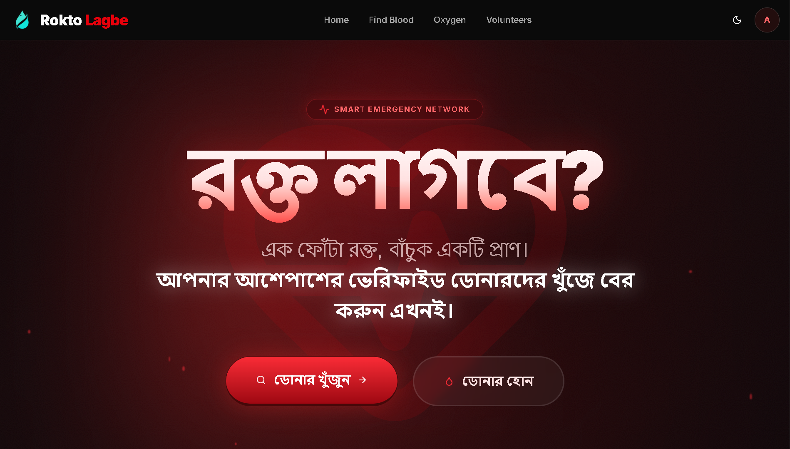

# 🩸 Rokto Lagbe? (রক্ত লাগবে?)
**Bangladesh's Smart Emergency Blood & Oxygen Network**

"Rokto Lagbe?" is a modern, fast, and secure web platform designed to connect people in medical emergencies with verified blood donors, oxygen suppliers, and volunteers across Bangladesh. 

 ## 🚀 Key Features
* **Smart Donor Finder:** Instantly search for blood donors based on blood group and availability.
* **Oxygen Network:** Find active oxygen suppliers in your area during critical moments.
* **Volunteer Dashboard:** Dedicated portal for volunteers to manage requests and availability.
* **Secure Authentication:** Passwordless/Email-based secure login system powered by Supabase.
* **Role-based Admin Panel:** Centralized control for administrators to verify users and manage the platform.

## 💻 Tech Stack
* **Frontend:** Next.js 16 (App Router), React, Tailwind CSS
* **Backend/Database:** Supabase (PostgreSQL, Auth, RLS Policies)
* **UI Components:** Lucide Icons, Custom UI components
* **Deployment:** Vercel


## 🚀 Live Demo
[Click here to view the live project](https://rokto-lagbe-as.vercel.app) 



---

## 🛠️ Local Development Setup

1. **Clone the repository:**
   ```bash
   git clone https://github.com/atul-dev-ai/rokto-lagbe.git

2. Install dependencies:
   ```bash
   cd rokto-lagbe
   ```
   
   ```bash
   npm install
   ```

3. Environment Variables:
   Create a `.env.local` file in the root directory and add your

4. Supabase keys:
   ```Code snippet
   NEXT_PUBLIC_SUPABASE_URL=your_supabase_project_url
   ```
   ```Code snippet
   NEXT_PUBLIC_SUPABASE_ANON_KEY=your_supabase_anon_key
   ```

5. Run the development server:
   ```bash
   npm run dev
   ```

  Open `http://localhost:3000` with your browser to see the result.


## 👨‍💻 Developed By
<b> Atul Paul </b> Full-Stack Web Developer ---
Built with ❤️ to save lives.